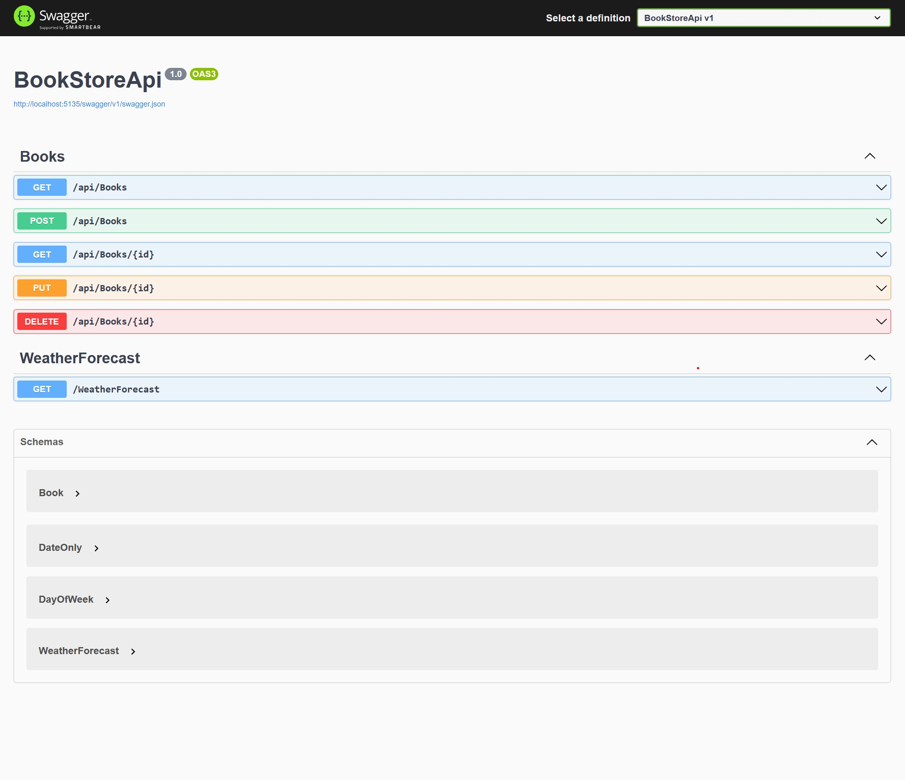

# Overview

This is a API built using ASP.NET Core. It is built around the idea of a bookstore. This was built to help me learn about .NET and its different options and configurations. It wasn't the first API I have built, but it was nice to use C# and .NET to make an API as it helped me connect it to what I learned using Node.js.

# Development Environment

I used Visual Studio working in a live server to watch my work in real time.